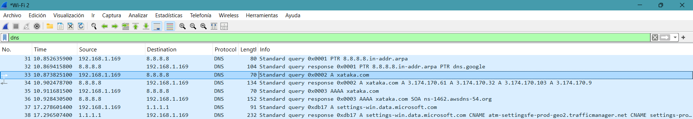
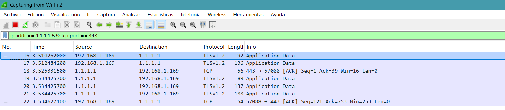

# Infraestructura DNS Segura y Filtrado de Telemetría IoT

[](https://www.docker.com/)
[](https://pi-hole.net/)
[](https://www.cloudflare.com/)

Solución de filtrado de contenido y seguridad a nivel de red desplegada mediante **Docker Compose**. Integra **Pi-hole** para la mitigación de rastreadores, publicidad y telemetría no deseada, junto con **cloudflared** como proxy de cifrado **DoH (DNS-over-HTTPS)**. Esta arquitectura garantiza que las consultas DNS no solo se filtren localmente, sino que viajen completamente cifradas e inalterables hacia internet.

## Estructura del Proyecto

```text
.
├── docker-compose.yml          # Definición de servicios, red privada y volúmenes
├── .env.example                # Plantilla para variables de entorno (sin secretos)
├── .gitignore                  # Exclusión de datos sensibles y persistencia local
├── README.md                   # Documentación técnica del proyecto
└── docs/
    ├── wireshark-dns-plain.png     # Captura de tráfico DNS tradicional (Puerto 53)
    └── wireshark-doh-encrypted.png # Captura de tráfico DoH cifrado (Puerto 443 / TLS)
```

---

## Arquitectura del Sistema

El flujo de procesamiento DNS dentro de la red contenerizada sigue una cadena estricta de aislamiento y cifrado:

```text
┌─────────────────────────┐
│   Cliente / Dispositivo │
└────────────┬────────────┘
             │ (Puerto 53 - UDP/TCP)
             ▼
┌─────────────────────────┐
│     Contenedor Pi-hole  │ ◄── [IP: 172.20.0.2]
│  (Filtrado y Listas)    │
└────────────┬────────────┘
             │
             │ (Puerto 5053 - Texto plano en red interna de Docker)
             ▼
┌─────────────────────────┐
│   Contenedor cloudflared│ ◄── [IP: 172.20.0.100] (Sin puertos expuestos)
│  (Proxy DoH / Cifrado)  │
└────────────┬────────────┘
             │
             │ (Puerto 443 - HTTPS/TLS / Cifrado DoH)
             ▼
┌─────────────────────────┐
│ Servidores Cloudflare   │ ◄── [1.1.1.1 / 1.0.0.1]
└─────────────────────────┘
```

---

## Características Principales

* **Filtrado de Contenido y Telemetría:** Interceptación y bloqueo de dominios maliciosos (phishing, malware), publicidad invasiva y telemetría de dispositivos IoT a nivel de red.
* **Cifrado DoH (DNS-over-HTTPS):** Implementación del protocolo DoH mediante `cloudflared`, evitando la inspección de tráfico por parte del proveedor de servicios de internet (ISP) o ataques *Man-in-the-Middle* (MitM).
* **Aislamiento de Red (Hardening):** El contenedor `cloudflared` opera en una red privada virtual de Docker (`pihole_network`) sin exponer ningún puerto al exterior, minimizando la superficie de ataque.
* **Redundancia Upstream:** Configuración de múltiples servidores upstream (`1.1.1.1` y `1.0.0.1`) para garantizar alta disponibilidad en la resolución de nombres.
* **Asignación Estática de IPs (IPAM):** Definición explícita de direcciones IP dentro de la subred `172.20.0.0/16` para asegurar persistencia y enrutamiento fiable entre servicios.
* **Persistencia de Datos:** Montaje de volúmenes locales (`./pihole` y `./dnsmasq.d`) para preservar la configuración, reglas personalizadas y estadísticas tras reinicios o actualizaciones.

---

## Requisitos del Sistema

* **Docker Engine** (v20.10+) o **Docker Desktop**
* **Docker Compose** (v2.0+)
* Acceso a terminal / PowerShell / Bash
* Wireshark (opcional, para auditoría de tráfico)

---

## Instalación y Despliegue

1. **Clonar el repositorio:**
   ```bash
   git clone https://github.com/tu-usuario/infraestructura-dns-segura.git
   cd infraestructura-dns-segura
   ```

2. **Configurar variables de entorno:**
   Crea un archivo `.env` en la raíz del proyecto para definir la contraseña del panel de administración de Pi-hole:
   ```env
   PIHOLE_PASSWORD=TuContraseñaSegura123
   ```

3. **Desplegar la infraestructura:**
   ```bash
   docker compose up -d
   ```

---

## Archivo de Configuración (`docker-compose.yml`)

```yaml
services:
  pihole:
    container_name: pihole
    image: pihole/pihole:latest
    ports:
      - "53:53/tcp"
      - "53:53/udp"
      - "80:80/tcp"
    environment:
      TZ: 'Europe/Madrid'
      FTLCONF_webserver_api_password: ${PIHOLE_PASSWORD}
      PIHOLE_DNS_: '172.20.0.100#5053' #Obliga al pihole a reenviar todas sus consultas al puerto del contenedor de cloudflared      
    volumes:
      - './pihole:/etc/pihole'
      - './dnsmasq.d:/etc/dnsmasq.d'
    networks:
      pihole_network:
        ipv4_address: 172.20.0.2
    restart: unless-stopped

  cloudflared:
    container_name: cloudflared
    image: cloudflare/cloudflared:2025.10.0
    command: proxy-dns --port 5053 --address 0.0.0.0 --upstream https://1.1.1.1/dns-query --upstream https://1.0.0.1/dns-query
    restart: unless-stopped
    networks:
      pihole_network:
        ipv4_address: 172.20.0.100

networks:
  pihole_network:
    driver: bridge
    ipam:
      config:
        - subnet: 172.20.0.0/16
```

---

## Verificación y Pruebas de Funcionamiento

### 1. Validación de Resolución por Terminal (CLI)

Para validar el correcto funcionamiento de toda la cadena de resolución y cifrado:

1. **Comprobar la resolución DoH desde `cloudflared`:**
   ```bash
   docker exec -it pihole dig @172.20.0.100 -p 5053 google.com +short
   ```
   *Debe responder con una o varias direcciones IP válidas.*

2. **Verificar la consulta global mediante Pi-hole:**
   ```bash
   nslookup google.com 127.0.0.1
   ```
   *Debe resolver correctamente a través de localhost (127.0.0.1).*

3. **Inspeccionar los logs del proxy cifrado:**
   ```bash
   docker logs --tail 20 cloudflared
   ```
   *Debe mostrar la inicialización del proxy DNS escuchando en `0.0.0.0:5053` y estableciendo conexiones DoH.*

### 2. Auditoría y Análisis de Tráfico de Red (Wireshark)

Para auditar el nivel de privacidad conseguido, se analizaron los paquetes de red capturados en la interfaz del host antes y después de implementar el túnel DoH:

#### A. Tráfico DNS Sin Cifrar (Tradicional - Puerto 53)

En una consulta convencional, el nombre de dominio viaja en texto plano. Cualquier observador en la red (ISP, router, o atacante) puede leer el campo `Name:` de la consulta:

  
*Figura 1: Captura de tráfico DNS plano en el puerto 53 dejando al descubierto el dominio consultado.*

#### B. Tráfico DNS-over-HTTPS Cifrado (DoH - Puerto 443)

Tras habilitar `cloudflared`, las peticiones hacia el exterior viajan encapsuladas mediante TLS 1.2 / TLS 1.3 a través del puerto seguro 443:

  
*Figura 2: Captura de Wireshark mostrando paquetes Application Data sobre TLS. La carga útil del paquete está totalmente cifrada, impidiendo la inspección del dominio consultado.*

---

## Mantenimiento y Actualizaciones

Para actualizar las imágenes de los contenedores a la última versión manteniendo todos los datos intactos:

```bash
# 1. Descargar las versiones más recientes
docker compose pull

# 2. Recrear los contenedores con las nuevas imágenes
docker compose up -d

# 3. Eliminar imágenes antiguas huérfanas
docker image prune -f
```
